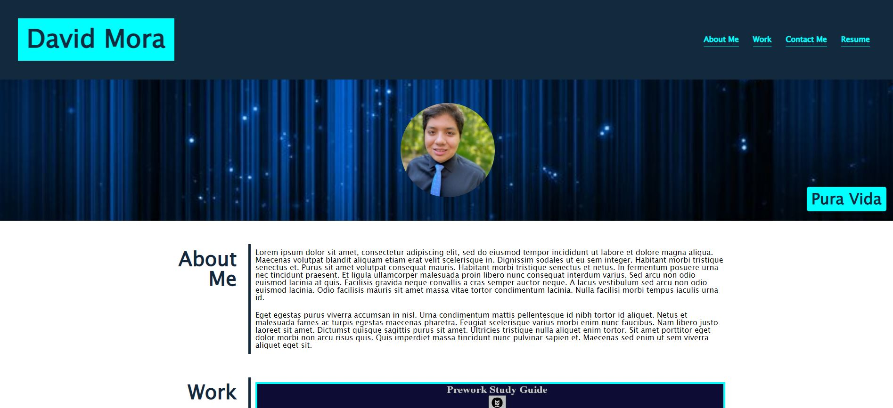

# dev-portfolio-dm

## Description

The starting template for a web developer portfolio that will feature completed projects, link to a resume, and displays my information aswell as contact information.

## Installation

GitHub Pages link: 

## Usage

Can be updated to include future project or can be used as a template for other portfolios. The nav bar links to parts of the web page and the contact bar has some functionality to send to my GitHub or send me an email. Only the pre work study guide project currently works as a link to a published project while the rest serve as place holders but all feature hover functionality.

## Credits

N/A

## License

Copyright (c) 2023 Prosentint

Permission is hereby granted, free of charge, to any person obtaining a copy
of this software and associated documentation files (the "Software"), to deal
in the Software without restriction, including without limitation the rights
to use, copy, modify, merge, publish, distribute, sublicense, and/or sell
copies of the Software, and to permit persons to whom the Software is
furnished to do so, subject to the following conditions:

The above copyright notice and this permission notice shall be included in all
copies or substantial portions of the Software.

THE SOFTWARE IS PROVIDED "AS IS", WITHOUT WARRANTY OF ANY KIND, EXPRESS OR
IMPLIED, INCLUDING BUT NOT LIMITED TO THE WARRANTIES OF MERCHANTABILITY,
FITNESS FOR A PARTICULAR PURPOSE AND NONINFRINGEMENT. IN NO EVENT SHALL THE
AUTHORS OR COPYRIGHT HOLDERS BE LIABLE FOR ANY CLAIM, DAMAGES OR OTHER
LIABILITY, WHETHER IN AN ACTION OF CONTRACT, TORT OR OTHERWISE, ARISING FROM,
OUT OF OR IN CONNECTION WITH THE SOFTWARE OR THE USE OR OTHER DEALINGS IN THE
SOFTWARE.